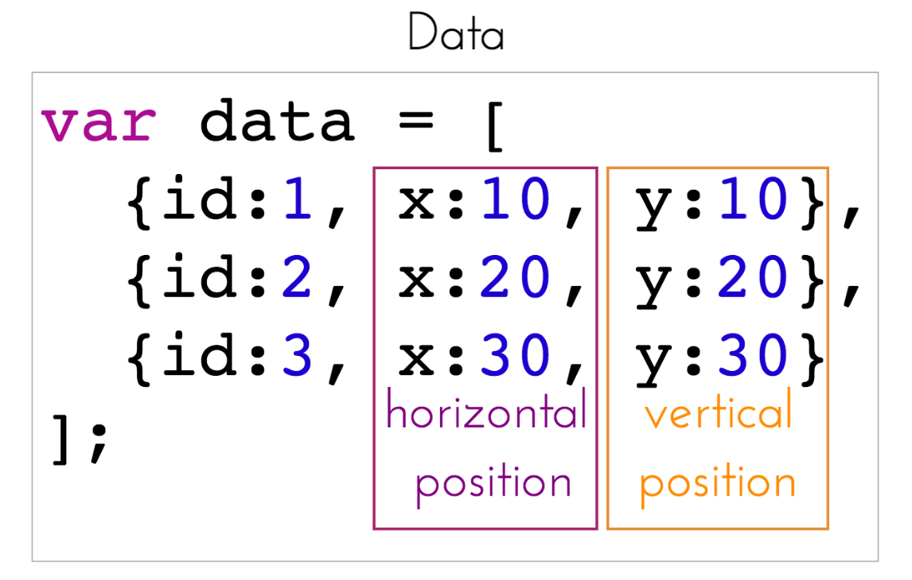
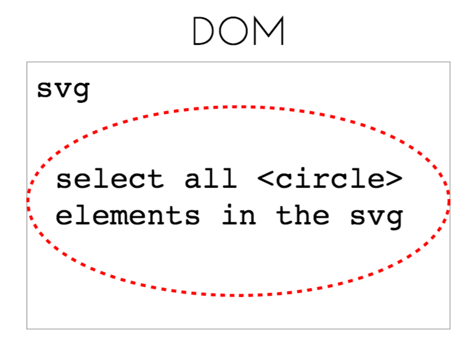
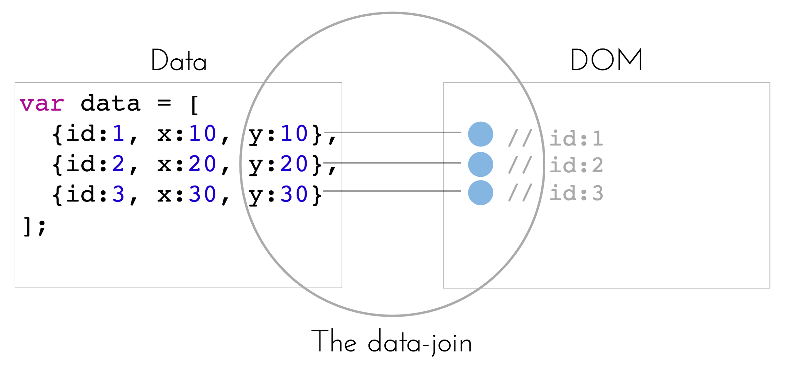
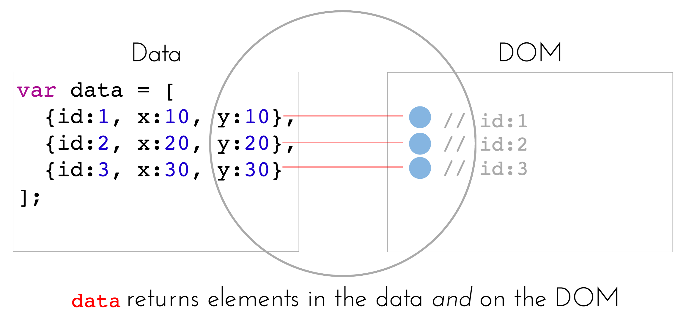
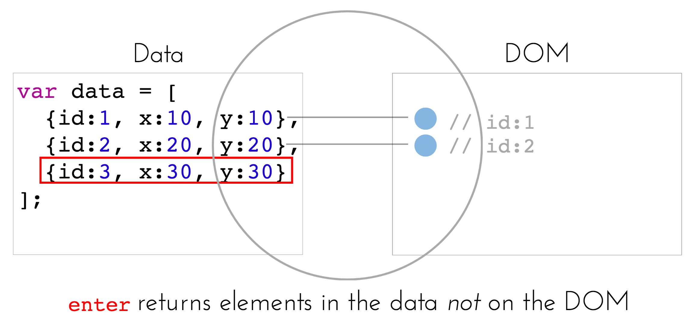
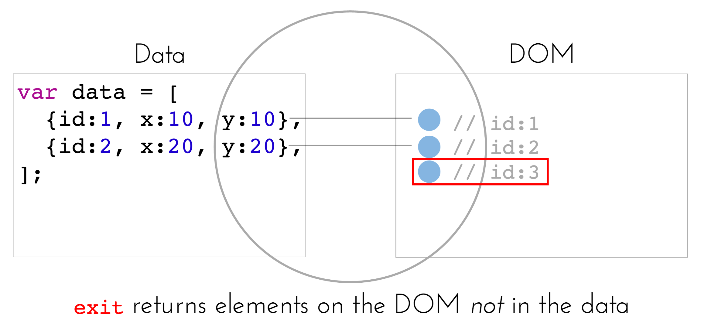

# Module 7: Introduction to D3.js

## Overview
Finally. Given the foundational skills of the previous modules, we're ready to start working with D3. Rather than provide you with some canned code to make some visualizations, this module challenges you to understand the inner-workings of the D3 library. It's simple to find the code for awesome examples online, but without understanding how the library actually works, you won't be able to adopt code to suit your needs, or invent novel layouts.

First, a clarification: even though we'll use D3 to build charts, it's **not**  _"charting library"_: it's a **DOM manipulation library** optimized for working with data. The "charts" you make are up to you - you want a bar chart? Make some rectangles. A scatter-plot? Put some circles on the DOM. D3 will provide you with a robust set of tools for translating between data properties and visual properties: the rest is up to you. The module focuses on how to leverage the D3 library to create visual elements from your data. Once you understand how to drive a graphical layout with data, picking up the rest of the library will be (comparatively) trivial.

<!-- START doctoc generated TOC please keep comment here to allow auto update -->
<!-- DON'T EDIT THIS SECTION, INSTEAD RE-RUN doctoc TO UPDATE -->
**Contents**

- [Resources](#resources)
- [Introductory Methods](#introductory-methods)
- [Binding Data](#binding-data)
  - [Challenge](#challenge)
  - [Solution](#solution)
    - [Selections](#selections)
    - [The Data Join](#the-data-join)
  - [Implications](#implications)

<!-- END doctoc generated TOC please keep comment here to allow auto update -->

## Resources
The open source community has generated a plethora of D3 resources: here are a few that I believe help capture the core concepts that you need to understand to harness the power of the library.

- [Thinking with Joins](https://bost.ocks.org/mike/join/) _(Bostock)_
- [D3 Selections](https://bost.ocks.org/mike/selection/) _(Bostock, detailed)_
- [Three little circles (intro description)](https://bost.ocks.org/mike/circles/) _(Bostock)_
- [D3 Data Binding](http://alignedleft.com/tutorials/d3/binding-data) _(alignedleft)_
- [D3 Update Pattern](https://www.dashingd3js.com/lessons/d3-basic-general-update-pattern) _(dashingD3 video)_
- [D3 Data Binding](https://square.github.io/intro-to-d3/data-binding/) _(square)_
- [General Update Pattern Example](https://bl.ocks.org/mbostock/3808218) _(Bostock)_
- [D3 Selection Documentation](https://github.com/mbostock/d3/wiki/Selections#wiki-data) _(D3 Wiki)_
- [D3 Website](http://www.w3schools.com/jquery/jquery_ajax_get_post.asp) (_w3schools_)

## Introductory Methods
Before we dig into the core methods of D3, let's explore some of it's functionality. Similarly to jQuery, D3 provides us with an API for manipulating the DOM. Like jQuery, you can add, remove, and manipulate elements. In the table below, you can see _some of_ the comparable methods for jQuery and D3. Unlike jQuery, when creating new DOM elements with D3 syntax, there is no need to wrap elements in the caret characters (`<` and `>`). For example, to append a new paragraph, you would use `.append('p')` as oppsed to `.append('<p></p>')`.

<a id="intro-syntax"></a>

| Action |	jQuery Syntax	| D3 Syntax |
| ------------- |  ------------- |------------- |
| Select an element from the DOM	| `$('selector')`	| `d3.select("selector")` |
| Get element attribute |	`$('selector').attr('attr-name')`	| `d3.select('selector').attr('attr-name')` |
| Set element attribute	| `$('selector').attr('attr-name', 'attr-value')`	| `d3.select('selector').attr('attr-name', 'attr-value')` |
| Set element style	| `$('selector').css('style-name', 'style-value')`	| `d3.select('selector').style('style-name', 'style-value')` |
| Append a DOM element	| `$('selector').append('<tag-name></tag-name>')`	| `d3.select('selector').append('tag-name')` |

Importantly, as we've seen in other libraries, D3 takes advantage of a **method chaining** pattern in which each method returns a D3 object which you can further manipulate. For example, you could set multiple attributes of an `svg` element as follows:

```javascript
// Select an svg element, then set its width and height attributes, and it's opacity style
d3.select('svg') // selects the element by element type, returns the first svg
  .attr('width', 400) // sets the width, then returns the svg for further changes
  .attr('height', 400) // sets the height, then returns the svg for further changes
  .style('opacity', .5); // sets the opacity, and terminates the chain with a semi-colon
```

**Make sure not to interrupt your chain with the `;`**. For practice getting/setting values of attributes/styles, and appending elements to the page, see [exercise-1](exercise-1).

## From Data to DOM
In order to properly leverage the power of D3, you **must** understand how it binds data to visual properties. Many of the [resources](#resources) above were selected because of their clear explanations of the core D3 methods. I **strongly suggest** you use them as a supplement to the sections below. The following sections explain the [challenge](#challenge) D3 is designed to address, the [solution](#solution) to the challenge, and the [implications](#implications) of the implementation.

### Challenge
Almost all new D3 users find themselves asking the same question -- _why is it so challenging to make a simple chart_? As stated above, D3 is built to bind data to visual properties, not make out of the box charts (there are [plenty of other libraries](https://en.wikipedia.org/wiki/Comparison_of_JavaScript_charting_frameworks) for that). Challenges developers(designers) to build charts from scratch forces them to truly engage in the practice of visualization - encoding data with visual properties. D3 provides an API for encoding data with visual properties like position, length, angle, color, area, and others. So the first question is, **how do we move from data to visual _elements_?**


You already know that each visual element needs to be represented in the DOM, and the jQuery (and D3) libraries provide you with a syntax for manipulating the DOM. Unfortunately, jQuery [lacks a clear approach](http://stackoverflow.com/questions/3642035/jquerys-append-not-working-with-svg-element) for manipulating the visual properties of `svg` elements. However, using the syntax introduced in the section above, you could easily solve this problem by using D3's `.append` method for a series of elements.

The second question becomes, **how do we move from data to visual _encodings_?** We'll need an approach for specifying the relationship between _data attributes_ and _visual attributes_:



Using the `.attr` method described above, you can assign a visual attrbiute a value using an element's data. Here is a **very non-D3 way** to use D3 to accomplish our goal thus far:

```javascript
// Dataset you want to visualize. Assume you want a scatterplot the expresses x and y positions
var data = [
  {id:1, x:10, y:10},
  {id:2, x:20, y:20},
  {id:3, x:30, y:30}
];

// Select an SVG from the DOM
var svg = d3.select('#my-svg');

// Loop through data and append a new circle element for each (DON'T ACTUALLY DO THIS!)
data.forEach(function(d){
  // For each element in data, append a circle and define it's styles.
  svg.append('circle')
     .attr('cx', d.x)
     .attr('cy', d.y)
     .attr('r', 5);

  // Append the circle to the svg
  svg.append(circle);
});
```

Great -- all done... Until you want to change the data and update the visualization. There are numerous changes you may want to make to your visual display depending on how your data changes. For example, between two data states, some new observations may enter the dataset, other may leave,, and some observations may simply change values. This is a very common, say if you've built a visualization where you can select the year of data being visualized, and in each year you may be missing some values. Out of this challenge emerge a few requirement:

- Keep track of which piece of data is associated with which visual element on the DOM
- Append elements to the DOM when the elements **enter** the dataset
- Facilitate animated transitions of visual elements whose underlying data values have been **updated**
- Enable the simple removal of data **exits** dataset

D3 provides us with a structure for ~~easily~~ managing the relationship between elements in our dataset and elements that appear in the DOM.

### Solution
This section explores both the conceptual approach and related syntax used by D3 to address the challenges noted above. If you understand the underlying approach, you'll be able to stretch the limits of the library. Conversely, if you simply copy and paste examples, you'll be lost and unable to create novel visualizations. Understanding how data-binding works is **the most important** thing about working with D3, so pay close attention, and consult the other [resources](#resources).

#### Selections
Recall that in the [table above](#intro-syntax), the `d3.select` method allow us to select an element from the DOM. However, **it will only return one element**. To select multiple elements, you can use the `d3.selectAll` method, which will return an array of elements([..more or less...](https://bost.ocks.org/mike/selection/)). These select methods allow you to query content in the DOM using [CSS3 selectors](https://www.w3.org/TR/css3-selectors/#selectors) as you would using jQuery:

```javascript
// Select all paragraphs
d3.selectAll('p')

// Select all element with class point
d3.selectAll('.point')

// Select all circle elements with class point
d3.selectAll('circle.point')
```
This will allow us to **select** the DOM elements that we want to associate with our data. The confusing part is, the first time data is bound to visual elements, you will **bind your data to an empty selection**.



While it may seem strange, this makes sense because the initial time that your dataset is associated with elements on the DOM, all elements need to be added. In the section below, keep in mind that you're binding your data to a selection of elements within an svg, not to the svg itself.

#### The Data Join
The true magic of D3 is the set of methods used for associated data with visual elements. To start our own lesson on [Thinking with Joins](https://bost.ocks.org/mike/join/), let's assume that you want to associate each element in your dataset with a `<circle>` in your DOM. You'll need to begin by making a selection of `<circle>` elements within the element (an `<svg>`) in which you would like to render the circles. As you suspect, **this selection will be empty** as described above.

Let's return to our diagram above. We don't simply need a method for taking an array of objects and creating circles, we need to associate each element in the array with an element in the DOM and **keep track of that relationship**. We'll refer to this as the _data-join_:




To perform a _data join_ between your data array and the array of selected elements, you'll use the `.data` method, which allows you to specify an **array of data** and a `key` function that explicitly specifies a unique identifier to associate each piece of data with a DOM element (by default, position in the array is used as the identifier, which can get messy).

```javascript
// Dataset you want to bind to DOM circle elements.
var data = [
  {id:1, x:10, y:10},
  {id:2, x:20, y:20},
  {id:3, x:30, y:30}
];

// Select an SVG from the DOM in which you want to render your circles
var svg = d3.select('#my-svg');

// Bind data to your selection of circles, specifying that the `id` property of each object is the identifying characteristic
svg.selectAll('circle')
  .data(data, function(d){return d.id});
```


By default, the `.data` method returns **the elements present in both the data and the DOM**, which at this point is empty. However, the object returned by `.data` also exposes two additional methods for detecting elements that are in the data but not the DOM (`.enter`) or elements that are on the DOM that are no longer in the data (`.exit`). More specifically;

>**data**: This method performs the data-join between your dataset and the elements in the DOM. It will return an array of nodes for items present in your data array that are also represented in the DOM. You can then manipulate these nodes, or leverage the `enter` and `exit` methods to determine the imbalances in the relationship between your data and your DOM ([docs](https://github.com/mbostock/d3/wiki/Selections#wiki-data))



>**enter**: This method returns an array of (placeholder) nodes for items present in your data array that are not (yet) in the DOM. You will use `enter` when adding new elements to the DOM. This method is only accessible on the selection returned by the `.data` operator ([docs](https://github.com/mbostock/d3/wiki/Selections#enter))



>**exit**: This method returns an array of nodes present in your DOM that are no longer in the data array. You will use `exit` when removing elements from the DOM.This method is only accessible on the selection returned by the `.data` operator ([docs](https://github.com/mbostock/d3/wiki/Selections#exit))



To continue the (seemingly simple) task of adding circles to the screen, we would use the `.enter` method to determine which elements in our data array are not represented on the screen. For each element, we could then use the `.append` method to add a circle and specify attributes using the `.attr` method:

 ```javascript
// Continuing with the above example `data` and selected `svg` element
svg.selectAll('circle') // select all circles in the svg
  .data(data, function(d){return d.id}) // bind data to your selection
  .enter() // return elements in the data not in the DOM
  .append('circle') // append a circle for each one of these new elements
  .attr('r', 5) // set a constant radius of 5
  .attr('cx', function(d) {return d.x}) // specify the x attribute
  .attr('cy', function(d) {return d.y}); // specify the y attribute  
 ```

You'll notice that in the example above, an anonymous function is used to specify the `cx` and `cy` attributes. These functions take in a parameter `d`, which sequentially takes on the value of each element in the `data` array. So, for the first circle, `d` is `{id:1, x:10, y:10}`, so the object properties can be used to specify visual properties (**which is the whole point**).

Let's imagine that the element with `id:2` is removed from the `data` array. Following that change, you would **need to bind your updated data to your selection**, and use the `.exit` method to determine which elements are no longer present in the data. You could then use the `.remove` method to delete the element from the DOM. Note, the `exit` method only **tells you what should be removed**, it **does not** remove them.

```javascript
// Data is updated
var data2 = [
  {id:1, x:10, y:10},
  {id:3, x:30, y:30}
];

// Make another selection in which circles are already on the screen
svg.selectAll('circle') // select all circles in the svg
 .data(data2, function(d){return d.id}) // bind the new data to your selection
 .exit() // determine which elements are in the DOM but not in your data array
 .remove() // remove these elements
```


Let's imagine a third situation in which the data values are updated. The `.data` method returns the elements which need to be **updated**, so you can specify the new positions you would like to apply:

```javascript
// Updated the y values
var data2 = [
  {id:1, x:10, y:20},
  {id:2, x:20, y:30},
  {id:3, x:30, y:40}
];

// Make another selection in which circles are already on the screen
svg.selectAll('circle') // select all circles in the svg
 .data(data2, function(d){return d.id}) // bind the new data to your selection
 .attr('r', 5) // set a constant radius of 5
 .attr('cx', function(d) {return d.x}) // specify the x attribute
 .attr('cy', function(d) {return d.y}); // specify the y attribute  
```

Better yet, you can use the `.transition` method to animate changes between the two states ([docs](https://github.com/mbostock/d3/wiki/Transitions)). Transitions apply a transformation between visual attributes such as position, length, area, color, etc..

```javascript
// Make another selection in which circles are already on the screen
svg.selectAll('circle') // select all circles in the svg
 .data(data2, function(d){return d.id}) // bind the new data to your selection
 .transtion() // stage a transition for the attributes that follow the method
 .duration(500) // set a time of 500 ms to transition between the states
 .attr('r', 5) // set a constant radius of 5
 .attr('cx', function(d) {return d.x}) // specify the x attribute
 .attr('cy', function(d) {return d.y}); // specify the y attribute  
```

While this may be a complex solution to the challenges outlined above, it provides you with precise control over the relationship between your data and the DOM elements you create. For some initial exercise using data-joins, see [exercise-2](exercise-2).

### Implications
While the above section introduced how D3 provides a set of tools for that enable establishing and maintaining the relationship between a data structure and the DOM, this section describes some initial approaches for implementation. There are a few lessons derived from the affordances and limitations of the data-join process:

- You need to use `enter`, `exit`, and `update` in conjunction to properly manage the DOM, and
- You will need to call all functions **each time data is updated**

First, we'll look at patterns we can use to combine the `enter`, `exit`, and `update` methods. Let's begin with a little more information about the `enter` method from [this article](https://bost.ocks.org/mike/selection/):

>To reduce duplicate code, enter.append has a convenient side-effect: it replaces null elements in the update selection with the newly-created elements from the enter selection. Thus, after enter.append, the update selection is modified to contain both entering and updating elements. The update selection subsequently contains all currently-displayed elements:

This allows us to manipulate visual attributes of updating and entering elements simultaneously. To do this, we need to **store the data-join in a variable**. For example:

```javascript
// Dataset you want to visualize.
var data = [
  {id:1, x:10, y:10},
  {id:2, x:20, y:20},
  {id:3, x:30, y:30}
];

// Select an SVG from the DOM
var svg = d3.select('#my-svg');

// Store the data-join in a variable `circles`
var circles = svg.selectAll('circle') // select all circles in the svg
 .data(data, function(d){return d.id}); // bind the new data to your selection

// Add entering elements to the update data and append circle elements for each entering element
circles.enter()
       .append('circle');

// Manipulate the visual attributes of updating and entering elements
circles.attr('r', 5) // set a constant radius of 5
       .attr('cx', function(d) {return d.x}) // specify the x attribute
       .attr('cy', function(d) {return d.y}); // specify the y attribute  

// Remove any exiting elements
circles.exit().remove();
```

If you want to make changes to updating elements only, you can insert those changes _before_ using the `.enter` method, as seen in this [General Update Example](https://bl.ocks.org/mbostock/3808218).

The second takeaway is that you will have to repeat this process _**multiple times**_. Like any other process you would like to make reusable, you can simply wrap the above code in a function that accepts the data as a parameter:

```javascript
// Select an SVG from the DOM
var svg = d3.select('#my-svg');

// Reusable function that accepts data as a parameter
var draw = function(data) {
  // Store the data-join in a variable `circles`
  var circles = svg.selectAll('circle') // select all circles in the svg
   .data(data, function(d){return d.id}); // bind the new data to your selection

  // Add entering elements to the update data and append circle elements for each entering element
  circles.enter()
         .append('circle');

  // Manipulate the visual attributes of updating and entering elements
  circles.attr('r', 5) // set a constant radius of 5
         .attr('cx', function(d) {return d.x}) // specify the x attribute
         .attr('cy', function(d) {return d.y}); // specify the y attribute  

  // Remove any exiting elements
  circles.exit().remove();
};
```
This approach will be the basis of more involved reusability patterns in the future. While D3 has a robust set of functionality, the lessons in this module represent the core process you'll need to understand to build your visualizations.

For practice using this pattern, see [exercise-3](exercise-3).
