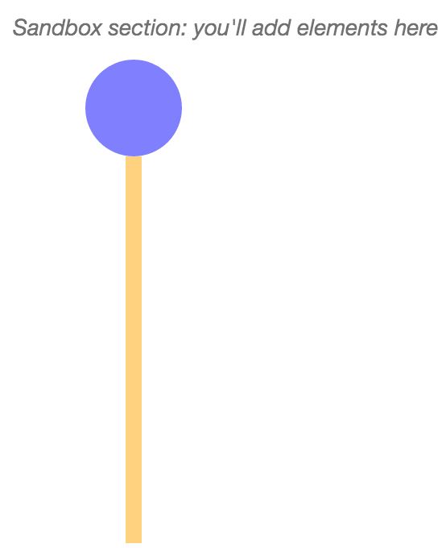

## Exercise 1: Introductory D3 Methods

In this exercise, you'll experiment a bit with `D3` to add elements to the DOM and manipulate their _attributes_ and _styles_. Start by forking and cloning this repository, running a local server, and opening up the `index.html` file. Then, edit the `js/main.js` to complete the outlined steps. You'll build this simple shape:

You may find the following resources helpful:

- [D3 Adding Elements](http://alignedleft.com/tutorials/d3/adding-elements)
- [D3 Chaining Methods](http://alignedleft.com/tutorials/d3/chaining-methods)

See the `complete` branch for answers.
