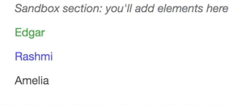

## Exercise 2: Experimenting with Data Binding

In this exercise, you'll experiment a bit with `D3` to see how to add and remove elements using data binding. Start by forking and cloning this repository, running a local server, and opening up the `index.html` file. Then, edit the `js/main.js` to complete the outlined steps. You'll build this simple shape:

You may find the following resources helpful:

- [Three little circles (intro description)](https://bost.ocks.org/mike/circles/)
- [D3 Data Binding](http://alignedleft.com/tutorials/d3/binding-data) _(alignedleft)_
- [Set Timeout](http://www.w3schools.com/jsref/met_win_settimeout.asp)

See the `complete` branch for answers.
