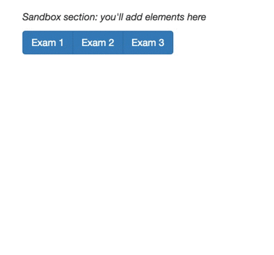

## Exercise 3: Mastering Data Binding

In this exercise, you'll write functions that demonstrate your familiarity with data-binding. Start by forking and cloning this repository, running a local server, and opening up the `index.html` file. Then, edit the `js/main.js` to complete the outlined steps. You'll write the code necessary to handle data-bindings for both `text` and `rect` elements:

You may find the following resources helpful:

- [Three little circles (intro description)](https://bost.ocks.org/mike/circles/)
- [D3 Data Binding](http://alignedleft.com/tutorials/d3/binding-data) _(alignedleft)_
- [Thinking with Joins](https://bost.ocks.org/mike/join/) _(Bostock)_
- [General Update Pattern Example](https://bl.ocks.org/mbostock/3808218) _(Bostock)_

See the `complete` branch for answers.
